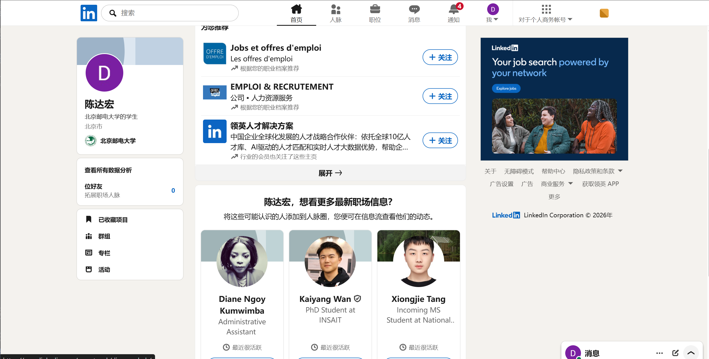
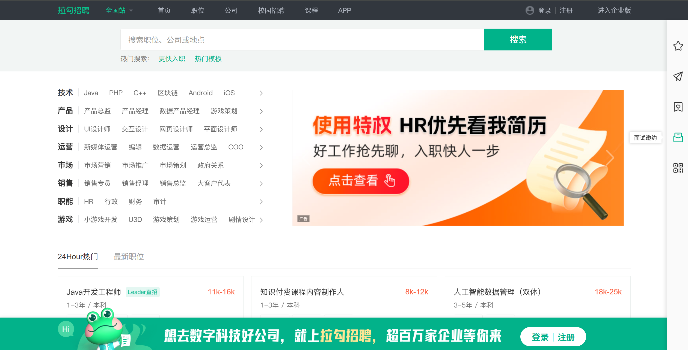
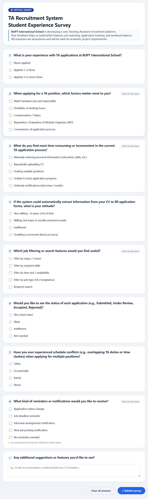

# 2. Supporting material

## 2.1 Two Websites We Analyzed

### linkedin.com

- **Analysis focus**: Job posting process, CV screening mechanism, and candidate matching presentation.
- **Key findings**:
  - The system automatically highlights the skill match between job requirements and candidate profiles, displaying a match score prominently in the candidate list.
  - Applicants can track application status (e.g., “CV viewed”, “Interview invited”), reducing information gaps.

### passport.lagou.com

- **Analysis focus**: Recruiter (MO) candidate management interface, sorting/filtering functions, and notification mechanisms.
- **Key findings**:
  - Recruiters can sort applicants by dimensions such as “match score”, “application date”, or “education level”, significantly improving screening efficiency.
  - The system pushes notifications like “job update reminders” and “interview invitations” to applicants.

## 2.2 Q&A from Interviews

### Interview 1: TA Applicant (applied for TA positions 3 times)

**Q:** What was the most inconvenient part when you applied for TA positions before?

**A:** The most inconvenient part was not knowing the progress of my applications. After submitting my CV, I had no idea whether it had been reviewed, whether I was shortlisted, or if I was rejected. Sometimes I would receive a notification after a long time, but in between it was a blind spot. I think the system should show the status of each application, such as "Submitted", "Under Review", "Shortlisted", "Accepted", or "Rejected".

---

### Interview 2: Module Organiser (recruited TAs for 3 modules)

**Q:** How do you currently select TAs, and what would you most like a system to help you with?

**A:** I currently go through CVs and Excel sheets one by one. The most time‑consuming part is matching the job requirements against each TA's CV. I wish the system could automatically calculate how well a TA matches a position, give a score, and highlight what skills are missing. That way I could quickly filter out obviously unsuitable candidates and save a lot of time.

---

### Interview 3: TA Applicant (currently applying for TA positions)

**Q:** What would you like to be able to do first when using a system to apply for TA jobs?

**A:** I hope I don't have to fill in all my information manually, especially my major, courses, and skills. It would be great if the system could extract those directly from my CV. Also, I would like the job list to be filtered by my major or skills, so I only see positions that match my background or time availability.

---

### Interview 4: Administrator (coordinates TA workload across modules)

**Q:** What difficulties have you encountered when allocating TAs across modules?

**A:** The main difficulty is avoiding overloading a single TA. Sometimes one TA is selected by multiple modules, and later they cannot handle the schedule, forcing us to find replacements. I would like to see, in one place, how many hours each TA has already been assigned. Ideally, the system would automatically warn me if a TA exceeds the limit or if there is a time conflict between two jobs.

---

### Interview 5: Module Organiser (concerned with long‑term recruitment efficiency)

**Q:** If the system could reduce your repetitive work, what would you want it to do?

**A:** Every time I post a job, I have to fill in many fields, though many modules have similar requirements. It would be convenient if I could duplicate a previous job and then modify it. Also, I would like to receive a simple notification whenever a student applies, so I don't have to keep refreshing the page to see new applications.

## 2.3 Survey by Online Questionnaire

An online questionnaire was distributed to students at BUPT International School. A total of 42 valid responses were collected. The survey aimed to understand user expectations, pain points, and desired features for the new TA Recruitment System.

### Questionnaire

### Survey Results

#### Q1. What is your experience with TA applications at BUPT International School?

| Option | Count | Percentage |
|--------|-------|------------|
| Never applied | 8 | 19% |
| Applied 1–2 times | 24 | 57% |
| Applied 3 or more times | 10 | 24% |

**Insight**: The majority (81%) have applied at least once, providing relevant experience for feedback.

---

#### Q2. When applying for a TA position, which factors matter most to you? (Multiple selection)

| Factor | Count | Percentage |
|--------|-------|------------|
| Match between job and major/skills | 37 | 88% |
| Flexibility of working hours | 29 | 69% |
| Compensation / Salary | 18 | 43% |
| Reputation / Evaluation of Module Organiser (MO) | 12 | 29% |
| Convenience of application process | 33 | 79% |

**Insight**: Skill matching (88%) and process convenience (79%) are top priorities. This supports the need for **US04** (job filtering) and **US10** (match score).

---

#### Q3. What do you find most time-consuming or inconvenient in the current TA application process? (Multiple selection)

| Inconvenience | Count | Percentage |
|---------------|-------|------------|
| Manually entering personal information | 34 | 81% |
| Repeatedly uploading CV | 22 | 52% |
| Finding suitable positions | 29 | 69% |
| Unable to track application progress | 31 | 74% |
| Untimely notifications | 25 | 60% |

**Insight**: Manual data entry (81%) and lack of progress tracking (74%) are the biggest frustrations, directly supporting **US03** (auto-fill from CV) and **US07** (application status tracking).

---

#### Q4. If the system could automatically extract information from your CV to fill application forms, what is your attitude?

| Attitude | Count | Percentage |
|----------|-------|------------|
| Very willing | 20 | 48% |
| Willing, but hope to modify extracted results | 18 | 43% |
| Indifferent | 3 | 7% |
| Unwilling | 1 | 2% |

**Insight**: 91% are willing or conditionally willing to use auto-fill. This strongly validates **US03** (auto-fill profile from CV).

---

#### Q5. Which job filtering or search features would you find useful? (Multiple selection)

| Filter type | Count | Percentage |
|-------------|-------|------------|
| Filter by major / course | 36 | 86% |
| Filter by required skills | 32 | 76% |
| Filter by time slot / availability | 28 | 67% |
| Filter by job type (TA / Invigilation) | 24 | 57% |
| Keyword search | 30 | 71% |

**Insight**: High demand for filtering by major (86%) and skills (76%) confirms the importance of **US04** (browse, search, filter jobs).

---

#### Q6. Would you like to see the status of each application (e.g., Submitted, Under Review, Accepted, Rejected)?

| Attitude | Count | Percentage |
|----------|-------|------------|
| Very much want | 28 | 67% |
| Want | 12 | 29% |
| Indifferent | 2 | 5% |
| Not needed | 0 | 0% |

**Insight**: 96% of respondents want status visibility. This is a direct validation of **US07** (view application status timeline).

---

#### Q7. Have you ever experienced schedule conflicts when applying for multiple positions?

| Frequency | Count | Percentage |
|-----------|-------|------------|
| Often | 8 | 19% |
| Occasionally | 22 | 52% |
| Rarely | 10 | 24% |
| Never | 2 | 5% |

**Insight**: 71% have experienced time conflicts at least occasionally, supporting the need for **US13** (detect schedule conflict or overload).

---

#### Q8. What kind of reminders or notifications would you like to receive? (Multiple selection)

| Notification type | Count | Percentage |
|-------------------|-------|------------|
| Application status change | 36 | 86% |
| Job deadline reminder | 29 | 69% |
| Interview arrangement notification | 34 | 81% |
| New job posting notification | 21 | 50% |
| No reminders needed | 2 | 5% |

**Insight**: Strong demand for status change (86%) and interview notifications (81%) validates **US15** (receive notifications and reminders).

